# PPU Implementation Architecture

This document describes the class-level design of the PPU project and the Emulator changes required to integrate it. It is scoped to the **minimal 8-bit configuration** (256-byte VRAM, 1bpp, 16×13 tilemap, CHR in ROM) as the first implementation target.

Refer to `ppu.md` for the authoritative design reference (MMIO layout, VRAM layout, rendering rules, co-simulation model). This document assumes familiarity with that reference.

---

## Layers

The architecture is organised into four layers:

| Layer | Project | Responsibility |
|---|---|---|
| Configuration | PPU | Parameter structs that drive all sizing and timing decisions |
| Storage | PPU | VRAM, MMIO registers, CHR ROM |
| Rendering | PPU | Scanline pipeline, sprite evaluation, pixel output |
| Debugger integration | PPU + Emulator | Tick traces, watchpoints, co-simulation coordinator |

---

## Layer 1 — Configuration

### `PpuConfig` (struct) — _new_

Central parameter object. No logic — pure data. Drives every other class.

| Property | Notes |
|---|---|
| `ScreenWidth`, `ScreenHeight` | 128, 104 for minimal |
| `TilemapWidth`, `TilemapHeight` | Derived: `ScreenWidth / 8`, `ScreenHeight / 8` → 16, 13 |
| `BitsPerPixel` | 1 for minimal |
| `BytesPerTile` | Derived: `8 × 8 × bpp / 8` → 8 for minimal |
| `TileCount` | 256 for minimal |
| `ChrInRom` | `true` for minimal — excludes CHR from VRAM layout |
| `ColormapCount` | 0 for minimal (monochrome, no palette) |
| `SpriteCount` | 16 for minimal |
| `BytesPerSprite` | 3 for minimal |
| `MaxSpritesPerScanline` | 8 |
| `CyclesPerScanline`, `VBlankStartScanline`, `TotalScanlines` | Scanline timing constants |
| `PpuCyclesPerCpuCycle` | Clock ratio; set by Emulator before simulation starts |
| `Layout` | Computed property returning `new PpuVramLayout(this)` |

Static factory methods:
- `Minimal8Bit` — the 256-byte configuration described in `ppu.md`
- `Default` — the richer `#if x16` standard configuration for the later implementation phase

**Connects to**: passed by value to `PpuVramLayout`, `Renderer`, `SpriteEvaluator`, `Ppu`.

---

### `PpuVramLayout` (struct) — _new_

Derives all VRAM region byte offsets from a `PpuConfig`. When `ChrInRom == true`, `ChrSize = 0` and the tilemap starts at `0x00` rather than after CHR data.

| Property | Minimal value | Notes |
|---|---|---|
| `TilemapBase` | `0x00` | Start of tilemap |
| `TilemapSize` | 208 | 16 × 13 |
| `OamBase` | `0xD0` | Immediately after tilemap |
| `OamSize` | 48 | 16 sprites × 3 bytes |
| `TotalSize` | 256 | Exact VRAM budget |

Helper methods: `TilemapOffset(int col, int row)`, `OamEntryOffset(int index)`.

**Connects to**: `PpuRegisters` (offset calculations), `SpriteEvaluator`, `ScanlineRenderer`.

---

## Layer 2 — Storage

### `PpuRegisters` (class) — _existing, modify_

Currently owns the VRAM array and implements `IMmioDevice`. After the change: VRAM ownership moves to `VRam`; `PpuRegisters` retains only the MMIO register interface. Changes required:

- Accept `PpuConfig config, VRam vram` in constructor. `PpuConfig` drives latch behaviour (`ChrInRom` → single-write latch); `VRam` is the backing store for PPUDATA writes.
- Remove the hardcoded `_useLatch = vramSize > 256` expression. Derive from `config.ChrInRom` or `config.Layout.TotalSize <= 256`.
- Add `bool SpriteOverflow` property (written by `SpriteEvaluator`; read via `PPUSTATUS` bit 6).
- No longer owns the VRAM byte array. `WriteData` routes through the injected `VRam` instance.

**Connects to**: `Ppu` (owned by), `VRam` (injected; PPUDATA writes route through it), CPU address bus (via `IMmioDevice` through `BusDecoder`).

---

### `VRam` (class) — _new_

Owns the raw VRAM byte array. Single source of truth for all VRAM reads and writes within the PPU.

- Constructor: `VRam(int size)` — allocates the buffer.
- `byte Read(int address)` — bounds-checked; throws on out-of-range access.
- `void Write(int address, byte value)` — bounds-checked; throws on out-of-range writes.

`PpuRegisters` holds a reference and calls `Write` on each PPUDATA store. `ScanlineRenderer` and `SpriteEvaluator` receive the same `VRam` instance directly and call `Read` — no register indirection needed.

**Connects to**: `Ppu` (created by, passed to `PpuRegisters` and `Renderer`), `PpuRegisters` (writes via PPUDATA), `ScanlineRenderer` (tile and tilemap reads), `SpriteEvaluator` (OAM reads).

---

### `ChrRom` (class) — _new_

Read-only tile pattern library. For the minimal config: 256 tiles × 8 bytes = 2,048 bytes. Baked into the PPU at construction; never stored in VRAM and not modifiable at runtime.

- Constructor: `ChrRom(byte[] data)` — validates `data.Length == tileCount × bytesPerTile`.
- `byte ReadRow(int tileIndex, int row)` — returns the 1-byte row (8 pixels, 1bpp, MSB = leftmost pixel). Bounds-checked; returns `0` for out-of-range access.
- Static `Default` property — a hardcoded byte array (e.g., simple placeholder patterns) so the PPU is functional before a real ROM is provided.

**Connects to**: `Ppu` (owned by, passed to `Renderer` at construction), `ScanlineRenderer` (tile lookup during rendering).

---

## Layer 3 — Rendering

### `OamEntry` (struct) — _new_

Decoded, typed view of one 3-byte sprite OAM entry. Removes raw byte manipulation from the renderer.

Static factory: `Decode(byte positionByte, byte tileIndex, byte attrByte)`.

| Property | Source |
|---|---|
| `X` | `positionByte & 0x0F` |
| `Y` | `(positionByte >> 4) & 0x0F` |
| `TileIndex` | byte 1 |
| `Priority` | `attr bit 2` — `true` = in front of BG, `false` = behind BG |
| `HFlip` | `attr bit 1` |
| `VFlip` | `attr bit 0` |

**Connects to**: `SpriteEvaluator` (produces), `ScanlineRenderer` (consumes).

---

### `SpriteEvaluator` (class) — _new_

Given the OAM region of VRAM and the current tile-row being rendered, produces the list of active sprites (up to `MaxSpritesPerScanline`).

```csharp
ActiveSprites Evaluate(VRam vram, PpuVramLayout layout, int tileRow)
```

Returns an `ActiveSprites` value containing the matched `OamEntry[]` (capped at `MaxSpritesPerScanline`) and a `bool SpriteOverflow` flag. Lower OAM index = higher priority; array preserves OAM order.

For the minimal config, positioning is **tile-aligned** — one evaluation call covers 8 pixel scanlines. Evaluation happens during the HBlank of the *previous* tile-row, so the active sprite list is ready when pixel output begins (see `ppu.md` — Per-scanline sequence).

Sets `PpuRegisters.SpriteOverflow = true` when the cap is exceeded.

**Connects to**: `ScanlineRenderer` (evaluated list passed in), `VRam` (reads OAM directly), `PpuVramLayout` (OAM base offset), `OamEntry` (produces decoded entries).

---

### `TileRow` (static class) — _new_

Stateless bit-manipulation helpers. No instance needed.

- `bool GetPixel(byte rowByte, int pixelX, bool hFlip)` — extracts bit `pixelX` from a 1bpp tile row byte, respecting horizontal flip. `true` = opaque, `false` = transparent.

Keeping this as a static helper makes unit testing trivial and avoids duplicating the bit logic in both BG and sprite rendering paths.

**Connects to**: `ScanlineRenderer`.

---

### `ScanlineRenderer` (class) — _new_

The core rendering engine. Renders a single pixel scanline (128 pixels for minimal config) given the current VRAM state and pre-evaluated sprites.

```csharp
void RenderScanline(int scanline, VRam vram, ChrRom chr,
                    ActiveSprites sprites, PpuVramLayout layout, FrameBuffer frameBuffer)
```

Per-pixel loop (128 iterations):
1. Determine tile column and pixel-within-tile from `pixelX`.
2. Read the tilemap byte for `(col, row)` → BG tile index.
3. Look up the tile row in `ChrRom` (accounting for `VFlip`) → BG pixel bit via `TileRow.GetPixel`.
4. For each sprite in `sprites`, check if it covers `pixelX` → sprite pixel bit via `TileRow.GetPixel`.
5. Priority resolution (1bpp, monochrome):
   - Sprite-in-front opaque → sprite pixel (write `1`)
   - Sprite-behind opaque AND BG opaque → BG pixel (write `1`)
   - BG opaque → BG pixel (write `1`)
   - All transparent → backdrop (write `0`)
6. Write resolved byte to `FrameBuffer`.

No colormap is needed — 1bpp output is `0` (backdrop/black) or `1` (opaque/white).

**Connects to**: `VRam` (tilemap read), `ChrRom` (tile lookup), `TileRow` (pixel extraction), `SpriteEvaluator` (receives pre-evaluated `ActiveSprites`), `PpuVramLayout` (tilemap offset calculation), `FrameBuffer` (output).

---

### `FrameBuffer` (class) — _new_

Flat `byte[]` of `ScreenWidth × ScreenHeight` pixels. One byte per pixel: `0` = backdrop, `1` = opaque.

- `void SetPixel(int x, int y, byte value)`
- `byte GetPixel(int x, int y)`
- `void Clear()` — reset all pixels to `0`
- `ReadOnlySpan<byte> AsReadOnly()` — for the `dump-ppu` debugger command

**Connects to**: `Renderer` (owned by), `ScanlineRenderer` (written per scanline), `Ppu` (exposed read-only to Emulator for `DumpPpu`).

---

### `Renderer` (class) — _implemented_

Orchestrates frame-level rendering. Owned by `Ppu`. Manages the sequence of sprite evaluation and scanline rendering across all active scanlines.

State: current pre-evaluated `ActiveSprites` (built during the previous tile-row's implicit HBlank period).

Key methods:
- `void BeginFrame()` — clears `FrameBuffer`, resets internal scanline state.
- `void RenderScanline(int scanlineIndex, OamEntry[] nextScanlineSprites, Framebuffer buffer)` — called by `Ppu` once per active scanline tick. When starting a new tile-row block (every 8th scanline), calls `SpriteEvaluator` to prepare sprites for the next tile-row. Calls `ScanlineRenderer` for the current scanline.

Exposed read access:
- `IReadOnlyList<byte> ReadOnlyPixels` — **implemented**; provides read-only access to the completed framebuffer for RGB conversion in `Ppu.ConvertFramebufferToRgb()`.

**Connects to**: `Ppu` (owned by, driven by the tick loop), `SpriteEvaluator`, `ScanlineRenderer`, `FrameBuffer`.

---

### `Ppu` (class) — _existing, significant rewrite_

Top-level PPU class. Currently has hardcoded timing constants and no rendering. After the rewrite:

Constructor: `Ppu(PpuConfig config, IReadOnlyList<byte>? chrData = null)` — creates `ChrRom` internally from `chrData` (zero-filled if null), then creates `VRam(config.Layout.TotalSize)`, `PpuRegisters(config, vram)`, and `Renderer(config, vram, chrRom)` internally.

Key changes from the current skeleton:
- Replace the three `const int` timing constants with properties from `_config`.
- `Tick()` becomes `PpuTickResult Tick()` — returns whether a PPU watchpoint requested a halt.
- During each active scanline (when `_scanlineCycle == 0`), call `_renderer.RenderActiveScanline(...)`.
- When `_scanline == VBlankStartScanline`: set `_registers.VBlankActive = true`, fire `VBlankStarted`.
- When `_scanline` wraps back to `0`: call `_renderer.BeginFrame()`.
- Build a `PpuTickTrace` each tick and store it in `LastTrace` for the Emulator to collect.

Properties/events exposed to Emulator:
- `IMmioDevice Registers` — existing; wired into `BusDecoder`
- `event Action? VBlankStarted` — existing; Emulator wires to `cpu.RequestInterrupt()`
- `event Action<IReadOnlyList<byte>>? FrameReady` — **implemented**; fires after `VBlankStarted` with an RGB pixel buffer (`ScreenWidth × ScreenHeight × 3` bytes). The conversion (1bpp → monochrome RGB) lives in `ConvertFramebufferToRgb()`. Emulator wires to `display.UpdateFrame(rgb)`.
- `FrameBuffer FrameBuffer` — planned; read by `DumpPpu` command
- `PpuTickTrace LastTrace` — planned; read by `SimulationTicker` for watchpoint evaluation

**Connects to**: `CpuHandler` in Emulator (created by), `VRam`, `PpuRegisters`, `Renderer`. (`ChrRom` is an internal implementation detail, not visible to callers.)

---

## Layer 4 — Debugger Integration

### `PpuTickTrace` (struct) — _new, in `PPU` project_

Analogous to the CPU's `TickTrace`. Captures PPU state at one tick.

| Property | Type | Notes |
|---|---|---|
| `Scanline` | `int` | Current scanline index |
| `ScanlineCycle` | `int` | Cycle within the current scanline |
| `Event` | `PpuEvent` enum | `None`, `VBlankStart`, `VBlankEnd`, `FrameComplete` |

**Connects to**: `Ppu` (produced each tick), `PpuWatchpointContainer` in Emulator (evaluated for matches).

---

### `PpuTickResult` (struct) — _new, in `PPU` project_

Return value of `Ppu.Tick()`. A single field: `bool HaltRequested`. The `SimulationTicker` in Emulator checks this after each PPU tick and stops the co-simulation loop early if set.

---

### `IPpuWatchpoint` (interface) — _new, in `Emulator` project_

Mirrors `IWatchpoint` but operates on `PpuTickTrace`.

```csharp
int Id { get; }
bool Matches(PpuTickTrace trace);
string Description { get; }
```

Concrete implementations:
- `VBlankWatchpoint` — matches `trace.Event == PpuEvent.VBlankStart`
- `ScanlineWatchpoint(int targetScanline)` — matches `trace.Scanline == targetScanline && trace.ScanlineCycle == 0`

---

### `PpuWatchpointContainer` (class) — _new, in `Emulator` project_

Structurally identical to `WatchpointContainer` but typed for `IPpuWatchpoint` / `PpuTickTrace`. Shares `NextId()` counter with the CPU `WatchpointContainer` so IDs are globally unique across both containers.

`Check(PpuTickTrace trace) → IPpuWatchpoint?` — evaluated by `SimulationTicker` after each PPU tick.

**Connects to**: `SimulationTicker` (evaluated after each PPU tick), `Watchpoint` command (new sub-commands: `wp ppu vblank`, `wp ppu scanline N`).

---

### `SimulationTicker` (class) — _new, in `Emulator` project_

The central co-simulation coordinator. This class exists because executing states (`SteppingState`, `TickingState`, `RunningState`) call `cpu.Step()` or `cpu.Tick()` internally — and each of those CPU ticks must be followed by N PPU ticks. Without this class, the PPU would only get one tick per `CpuHandler.Tick()` call regardless of how many CPU micro-ticks occurred inside the state machine.

```csharp
internal class SimulationTicker(CPU.CPU cpu, Ppu? ppu, PpuWatchpointContainer ppuWatchpoints)
```

- `SimTickResult TickInstruction()` — mirrors `cpu.Step()`: runs CPU micro-ticks in a loop until `IsInstructionComplete`, calling `TickPpu()` after each individual micro-tick.
- `SimTickResult TickOnce()` — one `cpu.Tick()` followed by `TickPpu()`.
- `SimTickResult TickPpu()` — fires `PpuCyclesPerCpuCycle` PPU ticks, checking `PpuTickResult.HaltRequested` and `PpuWatchpointContainer` after each. Stops early and sets the halt flag if triggered.

`SimTickResult` (struct): wraps the CPU `TickTrace[]`, plus `IPpuWatchpoint? PpuWatchpointHit` and `PpuTickTrace? PpuHaltTrace`.

**Connects to**: `CpuStateContext` (threaded in as `SimTicker`), all executing states (replace direct `Context.Cpu.Step()` / `Context.Cpu.Tick()` calls).

---

## Emulator Changes

### `CpuStateContext` — _modify_

Add `SimulationTicker SimTicker` to the record. Executing states access `Context.SimTicker.TickInstruction()` or `Context.SimTicker.TickOnce()`. `Context.Cpu` is retained for inspector access.

### `ExecutingCpuState` — _modify_

`ExecuteStep()` returns `SimTickResult` instead of `void`. The base `Tick()` uses the result to check PPU watchpoint hits alongside the existing CPU breakpoint and watchpoint checks.

### `CpuStateFactory` — _modify_

Accept `SimulationTicker` in the constructor; thread it into `CpuStateContext` via `GetContextForState()`.

### `CpuHandler` — _modified_

**Implemented:**
- Constructor accepts `PpuConfig? ppuConfig = null` and `IReadOnlyList<byte>? chrData = null`. The PPU is created when `ppuConfig != null`; `chrData` is forwarded to `Ppu` (zero-filled internally if null).
- Creates `Ppu(ppuConfig, chrData)` and stores `_ppuTickRatio = PpuCyclesPerCpuCycle`.
- Subscribes `_ppu.FrameReady` and relays it as `public event Action<IReadOnlyList<byte>>? FrameReady` for `EmulatorApplication` to wire to the display.
- `Tick()` ticks the PPU proportionally: `microTicks * _ppuTickRatio` times per state tick, where `microTicks` is the CPU trace count for executing states (approximating cycle count), or 1 for idle/halted/error states.
- `TickFrame()` runs one full PPU frame's worth of state ticks (budget = `TotalScanlines × CyclesPerScanline / PpuCyclesPerCpuCycle`), stopping early if the CPU enters idle/halted/error state and completing remaining PPU ticks to ensure `FrameReady` fires.

**Planned (not yet implemented):**
- `PpuWatchpointContainer` and `SimulationTicker` — PPU watchpoints and true cycle-interleaved co-simulation remain future work.

### `Display` — _new, implemented_

`Emulator/Display.cs` wraps the Raylib window lifecycle:
- Constructor: `Display(int screenWidth, int screenHeight, int scale)` — calls `InitWindow`, allocates `Color[]` and `Texture2D`, sets 60fps target.
- `void UpdateFrame(IReadOnlyList<byte> rgbPixels)` — converts RGB triplets to `Color[]` and calls `UpdateTexture`.
- `void Render()` — `BeginDrawing` / `DrawTextureEx` (scaled) / `EndDrawing`.
- `bool ShouldClose` — forwards `WindowShouldClose()`.
- `IDisposable` — `UnloadTexture` + `CloseWindow`.
- Default scale: 4 (128×104 → 512×416 for Minimal8Bit).

### `EmulatorApplication` — _modified_

`Run()` now dispatches to `RunHeadless()` or `RunWindowed()` based on whether a `Display` was created:
- **Headless** (no `--vram`): original 10Hz `while(true)` loop, unchanged behaviour.
- **Windowed** (`--vram SIZE`): Raylib-driven ~60fps loop. `DrainCommands()` processes all pending stdin commands each frame. `StatusSuppressed = true` is set around `TickFrame()` to suppress per-tick JSON status output (see Output section). `Display.Render()` updates the window. Quit (`q`/`quit`/`exit`) and Raylib window-close both exit cleanly.

### `IOutput` / `ConsoleOutput` — _modified_

`bool StatusSuppressed { get; set; }` added to `IOutput`. `ConsoleOutput.WriteStatus()` early-returns when `StatusSuppressed` is true. Only per-tick status is suppressed — event outputs (`WriteBreakpointHit`, `WriteWatchpointHit`) are never suppressed.

### `DumpPpu` (class) — _new global command_

New `Emulator/Commands/GlobalCommands/DumpPpu.cs`, attribute `[Command("dump-ppu", "dppu")]`.

Outputs current PPU state as JSON:
```json
{
  "scanline": 42,
  "scanline_cycle": 17,
  "vblank": false,
  "sprite_overflow": false,
  "framebuffer": "<hex or base64 encoded 128×104 bytes>"
}
```

Requires `GlobalCommandExecutionContext` to expose a `Ppu?` field (alongside the existing `CpuInspector`).

---

## File Layout

```
PPU/
  PpuConfig.cs              ← new (PpuConfig struct + PpuVramLayout struct)
  ChrRom.cs                 ← new
  PpuRegisters.cs           ← existing, rewrite constructor + add SpriteOverflow
  VRam.cs                   ← new
  rendering/
    OamEntry.cs             ← new (struct + ActiveSprites wrapper)
    TileRow.cs              ← new (static helpers)
    SpriteEvaluator.cs      ← new
    ScanlineRenderer.cs     ← new
    FrameBuffer.cs          ← new
    Renderer.cs             ← new
  traces/
    PpuTickTrace.cs         ← new (struct + PpuEvent enum)
    PpuTickResult.cs        ← new (struct)
  Ppu.cs                    ← existing, significant rewrite

Emulator/
  SimulationTicker.cs                          ← new
  PpuWatchpointContainer.cs                   ← new (+ IPpuWatchpoint, VBlankWatchpoint, ScanlineWatchpoint)
  Commands/GlobalCommands/DumpPpu.cs          ← new
  CpuStates/CpuStateFactory.cs               ← modify (add SimulationTicker)
  CpuStates/ExecutingCpuState.cs             ← modify (use SimTickResult)
  CpuHandler.cs                               ← modify (create Ppu + SimulationTicker)
```

---

## Connection Diagram

```
PpuConfig ──────────────────────────────────────────┐
     └──► PpuVramLayout                             │
                                                    ▼
ChrRom ────────────────────────────────────► ScanlineRenderer
                                                    ▲     ▲
                            VRam ───────────────────┘     │
                              ▲   └──► SpriteEvaluator ───┘
                              │              │
PpuRegisters (MMIO) ──────────┘         ActiveSprites
      ▲                                      │
  CPU IBus (BusDecoder)               FrameBuffer ──► DumpPpu command
                                             │
                                        Renderer
                                             │
                                   Ppu (tick loop, VBlank event)
                                             │
          ┌──────────────────────────────────┼──────────────────────┐
          ▼                                  ▼                      ▼
    VBlankStarted                      PpuTickTrace            PpuTickResult
          │                                  │                      │
    cpu.RequestInterrupt()                   ▼                      │
                                   PpuWatchpointContainer           │
                                             │                      │
          └──────────────────────────────────▼──────────────────────┘
                                    SimulationTicker
                             ┌──────────────┼──────────────┐
                             ▼              ▼              ▼
                      SteppingState   TickingState    RunningState
```

---

## Class Diagram

Visibility prefixes follow Mermaid convention and reflect C# access modifiers:

| Prefix | C# modifier | Accessible from |
|--------|-------------|-----------------|
| `+` | `public` | Any project |
| `~` | `internal` | Same project only |
| `-` | `private` | Same class only |

```mermaid
classDiagram

    %% ── PPU project: configuration ───────────────────────────────────

    class PpuConfig {
        <<struct>>
        +bool ChrInRom
        +int BitsPerPixel
        +int TileCount
        +int SpriteCount
        +int BytesPerSprite
        +int CyclesPerScanline
        +int VBlankStartScanline
        +int TotalScanlines
        +int PpuCyclesPerCpuCycle
        +PpuVramLayout Layout
        +PpuConfig Minimal8Bit()$
        +PpuConfig Default()$
    }

    class PpuVramLayout {
        <<struct>>
        +int TilemapBase
        +int OamBase
        +int TotalSize
        +int TilemapOffset(int col, int row)
        +int OamEntryOffset(int index)
    }

    %% ── PPU project: storage ─────────────────────────────────────────

    class IMmioDevice {
        <<interface>>
        +byte ReadRegister(byte offset)
        +void WriteRegister(byte offset, byte value)
    }

    class PpuRegisters {
        <<internal>>
        +bool VBlankActive
        +bool SpriteOverflow
        +byte ReadRegister(byte offset)
        +void WriteRegister(byte offset, byte value)
    }

    class VRam {
        +byte Read(int address)
        +void Write(int address, byte value)
    }

    class ChrRom {
        +ChrRom Default$
        +ChrRom(byte[] data)
        +byte ReadRow(int tileIndex, int row)
    }

    %% ── PPU project: rendering ───────────────────────────────────────

    class OamEntry {
        <<struct, internal>>
        ~byte XTile
        ~byte YTile
        ~byte TileIndex
        ~bool Priority
        ~bool HFlip
        ~bool VFlip
        ~bool IsHidden
        ~OamEntry Decode(byte pos, byte tile, byte attr)$
    }

    class ActiveSprites {
        <<struct, internal>>
        ~OamEntry[] Sprites
        ~bool SpriteOverflow
    }

    class TileRow {
        <<static, internal>>
        ~bool GetPixel(byte rowByte, int pixelX, bool hFlip)$
    }

    class SpriteEvaluator {
        <<internal>>
        ~ActiveSprites Evaluate(VRam vram, PpuVramLayout layout, int tileRow)
    }

    class ScanlineRenderer {
        <<internal>>
        ~void RenderScanline(int scanline, VRam vram, ChrRom chr, ActiveSprites sprites, PpuVramLayout layout, FrameBuffer fb)
    }

    class FrameBuffer {
        +void SetPixel(int x, int y, byte value)
        +byte GetPixel(int x, int y)
        +void Clear()
        +byte[] AsReadOnly()
    }

    class Renderer {
        <<internal>>
        ~void BeginFrame()
        ~void RenderActiveScanline(int scanline, PpuRegisters vram, ChrRom chr)
    }

    %% ── PPU project: tracing ─────────────────────────────────────────

    class PpuEvent {
        <<enum>>
        None
        VBlankStart
        VBlankEnd
        FrameComplete
    }

    class PpuTickTrace {
        <<struct>>
        +int Scanline
        +int ScanlineCycle
        +PpuEvent Event
    }

    class PpuTickResult {
        <<struct>>
        +bool HaltRequested
    }

    %% ── PPU project: top-level ───────────────────────────────────────

    class Ppu {
        +IMmioDevice Registers
        +FrameBuffer FrameBuffer
        +PpuTickTrace LastTrace
        +Action VBlankStarted
        +PpuTickResult Tick()
    }

    %% ── Emulator project ──────────────────────────────────────────────

    class IPpuWatchpoint {
        <<interface, internal>>
        ~int Id
        ~string Description
        ~bool Matches(PpuTickTrace trace)
    }

    class VBlankWatchpoint {
        <<internal>>
        ~int Id
        ~string Description
        ~bool Matches(PpuTickTrace trace)
    }

    class ScanlineWatchpoint {
        <<internal>>
        ~int Id
        ~string Description
        ~bool Matches(PpuTickTrace trace)
    }

    class PpuWatchpointContainer {
        <<internal>>
        ~int Add(IPpuWatchpoint watchpoint)
        ~void Remove(int id)
        ~IPpuWatchpoint? Check(PpuTickTrace trace)
        ~int NextId()
    }

    class SimTickResult {
        <<struct, internal>>
        ~TickTrace[] CpuTraces
        ~IPpuWatchpoint? PpuWatchpointHit
        ~PpuTickTrace? PpuHaltTrace
    }

    class SimulationTicker {
        <<internal>>
        ~SimTickResult TickInstruction()
        ~SimTickResult TickOnce()
        -SimTickResult TickPpu()
    }

    class DumpPpu {
        <<internal>>
        ~CommandResult Execute(GlobalCommandExecutionContext ctx, string[] args)
    }

    %% ── Relationships ────────────────────────────────────────────────

    PpuConfig --> PpuVramLayout : creates
    PpuRegisters ..|> IMmioDevice
    Ppu *-- VRam : owns
    Ppu *-- PpuRegisters : owns
    Ppu *-- Renderer : owns
    Ppu *-- ChrRom : owns
    PpuRegisters --> VRam : writes
    Renderer *-- FrameBuffer : owns
    Renderer --> SpriteEvaluator : uses
    Renderer --> ScanlineRenderer : uses
    SpriteEvaluator ..> OamEntry : decodes
    SpriteEvaluator ..> ActiveSprites : returns
    ScanlineRenderer --> VRam : reads
    ScanlineRenderer --> TileRow : uses
    ScanlineRenderer --> ActiveSprites : reads
    ScanlineRenderer --> FrameBuffer : writes
    SpriteEvaluator --> VRam : reads
    PpuTickTrace --> PpuEvent : has
    Ppu ..> PpuTickResult : returns from Tick
    Ppu ..> PpuTickTrace : emits
    VBlankWatchpoint ..|> IPpuWatchpoint
    ScanlineWatchpoint ..|> IPpuWatchpoint
    PpuWatchpointContainer o-- IPpuWatchpoint : holds
    SimulationTicker --> Ppu : ticks
    SimulationTicker --> PpuWatchpointContainer : checks
    SimulationTicker ..> SimTickResult : returns
    DumpPpu --> Ppu : reads
```

Classes annotated `<<internal>>` are not part of the public API of the PPU project. Their members still carry `public` or `internal` modifiers as they appear in C# source.


